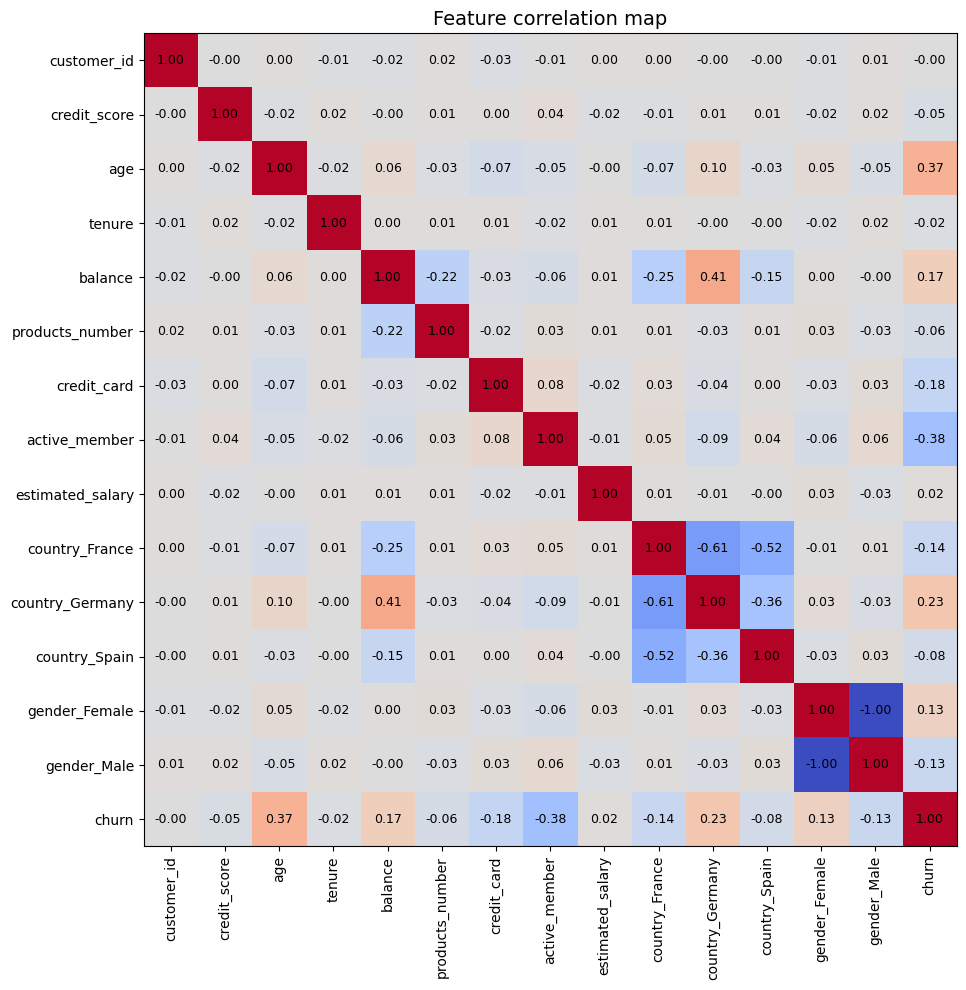
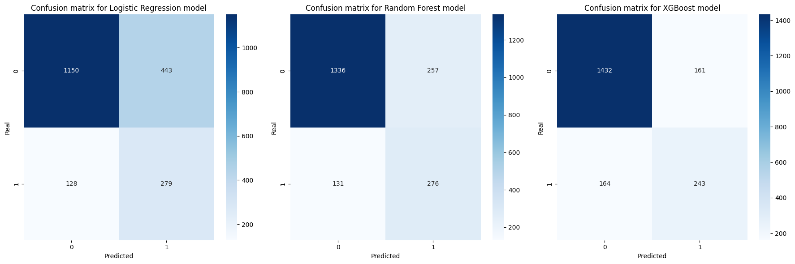
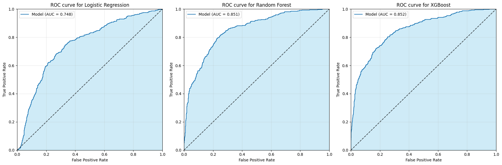
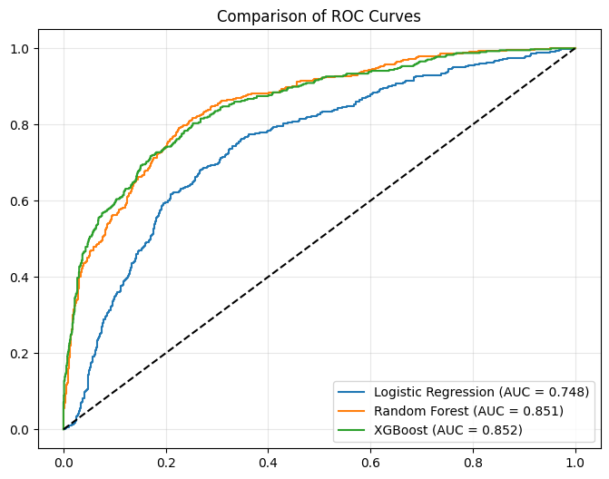

# Customer Churn Predictor

This project focuses on analyzing customer retention, identifying key churn drivers, and building a predictive model to help businesses reduce attrition. It is an end-to-end churn prediction pipeline using Python. Implements SMOTE for handling class imbalance, feature engineering, and model evaluation using ROC-AUC and F1-score.

## 📖 Project Overview

Customer churn is one of the most costly problems in the banking industry. This project builds a binary classification system that identifies customers at risk of leaving, allowing the business to take proactive retention actions.

The dataset comes from Kaggle and contains 10,000 records with features such as credit score, age, account balance, number of products, and country.

## 🎯 Business Objective

Customer churn is a critical metric for any subscription-based business. The goal of this project is to analyze customer behavior to build a model that accurately predicts churn, helping companies improve their retention rates and customer lifetime value (CLV).

## ✨ Key Features

#### 1. Exploratory Data Analysis (EDA)

- **Churn Rate Analysis**: Visualizing the baseline percentage of customers leaving.
- **Demographic Insights**: Analyzing churn patterns across gender, age groups, and contract types.
- **Service Usage**: Correlating monthly charges and tenure with the likelihood of attrition.

#### 2. Data Preprocessing

- **Data Cleaning**: Handling missing values, outliers, categorical encoding and scaling.
- **Handling Imbalance**: Using SMOTE (Synthetic Minority Over-sampling Technique) to address the typical class imbalance in churn datasets.

#### 3. Model Comparison

- **Advanced Modeling**: Comparative analysis of **Logistic Regression**, **Random Forest**, and **Gradient Boosting**.
- **Evaluation Metrics**: Models are assessed using F1-Score and AUC scores.

## 📊 Charts

Visualizing the data was a crucial step in understanding the relationships between features.

#### 1. Correlation heatmap

This matrix displays the Pearson correlation coefficients between numerical variables, highlighting which features have the strongest impact on the target.



#### 2. Confusion matrices for all models

The confusion matrices provide a detailed breakdown of correct and incorrect classifications. While Logistic Regression shows a balanced performance, XGBoost achieves the highest number of True Negatives (1432), significantly reducing the false alarm rate for customers who are not likely to churn.



#### 3. ROC curves for all models

The ROC curves visualize the trade-off between the True Positive Rate and False Positive Rate. XGBoost outperforms the other models with the highest AUC of 0.852, indicating a superior overall ability to distinguish between churning and loyal customers.



## 📈 Performance Comparison

| Model                   |     Precision     |      Recall       |     F1-score      | AUC score |
| :---------------------- | :---------------: | :---------------: | :---------------: | :-------: |
| **Logistic Regression** | 0: 0.90 / 1: 0.39 | 0: 0.72 / 1: 0.69 | 0: 0.80 / 1: 0.49 |   0.748   |
| **Random Forest**       | 0: 0.91 / 1: 0.52 | 0: 0.84 / 1: 0.68 | 0: 0.87 / 1: 0.59 |   0.851   |
| **XGBoost**             | 0: 0.90 / 1: 0.60 | 0: 0.90 / 1: 0.60 | 0: 0.90 / 1: 0.60 | **0.852** |

AUC was chosen as the primary metric due to class imbalance (~20% churn rate).

<br>

**Final results:**



## 🧠 Key Concepts Covered

**Class Imbalance Handling**:
The dataset is imbalanced (~80% stay, ~20% churn). _SMOTE_ (Synthetic Minority Oversampling TEchnique) is applied inside the Pipeline to generate synthetic samples for the minority class during training only, preventing data leakage.

**Stratified Splitting & Cross-Validation**:
_train_test_split_ uses _stratify=y_ to preserve class proportions in both sets. _StratifiedKFold_ (5 folds) ensures each fold during GridSearchCV also reflects the original class distribution.

**Preprocessing Pipeline**:
_ColumnTransformer_ handles numerical features (_StandardScaler_) and categorical features (_OneHotEncoder_) simultaneously. Wrapping everything in _imblearn.Pipeline_ guarantees that SMOTE, scaling, and encoding are fitted only on training folds — never on validation data.

**Hyperparameter Tuning**:
_GridSearchCV_ exhaustively searches defined parameter grids for all three models. Parameters are passed using the _classifier\_\_param_ notation specific to Pipeline steps.

**Model Comparison**:
Three classifiers are trained and compared — Logistic Regression, Random Forest, and XGBoost — using AUC scores, classification reports, confusion matrices, and ROC curves.

**ROC Curve & AUC**:
Individual ROC curves per model and a combined comparison chart are generated. AUC measures the probability that the model ranks a random churner above a random non-churner.

## 🛠️ Tech Stack

- **Language**: Python 3
- **Data manipulation**: pandas, NumPy
- **Visualisation**: Matplotlib, Seaborn
- **Machine learning**: scikit-learn
- **Gradient boosting**: XGBoost
- **Class imbalance**: imbalanced-learn (SMOTE)
- **Dataset**: kagglehub
- **Environment**: Jupyter Notebook

## 🚀 How to Run?

1. **Clone the repository:**
   ```bash
   git clone https://github.com/Mr-TwisT/Customer-Churn-Predictor.git
   ```
2. **Install dependencies:**
   ```bash
   pip install os kagglehub numpy pandas seaborn matplotlib sklearn xgboost imblearn
   ```
3. **Run the .ipynb file**
